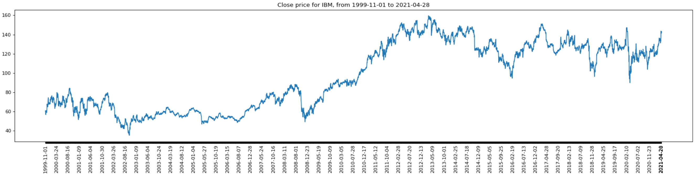
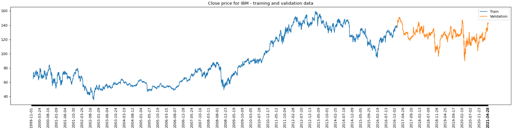
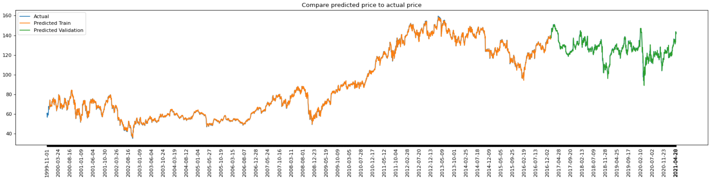
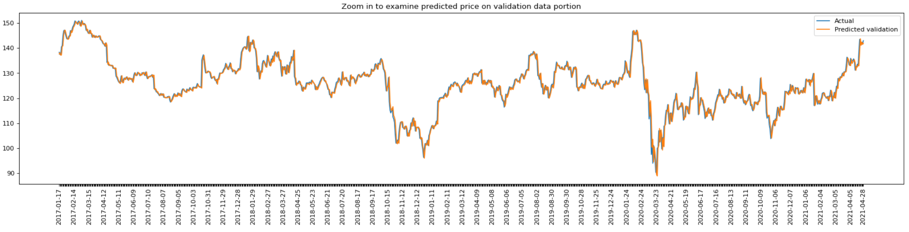

# Predicting Stock Prices with Deep Learning

## Project Overview

**Deep learning** is part of a broader family of machine learning methods based on artificial neural networks, which are [inspired](https://en.wikipedia.org/wiki/Deep_learning) by our brain's own network of neurons. Among the popular deep learning paradigms, [Long Short-Term Memory (LSTM)](https://en.wikipedia.org/wiki/Long_short-term_memory) is a specialized architecture that can "memorize" patterns from historical sequences of data and extrapolate such patterns for future events. 

Since the financial market is naturally comprised of historical sequences of equity prices, more and more quantitative researchers and finance professionals are using LTSM to model and predict market price movements. In this project, we will go through the end-to-end machine learning workflow of developing an LTSM model to predict stock market prices using PyTorch and Alpha Vantage APIs. 

The project is grouped into the following sections, which are representative of a typical [machine learning workflow](https://cloud.google.com/ai-platform/docs/ml-solutions-overview): 
- Installing Python dependencies
- Data preparation: acquiring financial market data from Alpha Vantage
- Data preparation: normalizing raw data
- Data preparation: generating training and validation datasets
- Defining the LSTM model
- Model training
- Model evaluation
- Predicting future stock prices

By the end of this project, you will have a fully functional LSTM model that predicts future stock prices based on historical price movements, all in a single Python file. This tutorial has been written in a way such that all the essential code snippets have been embedded inline. You should be able to develop, train, and test your machine learning model without referring to other external pages or documents. 

Let's get started!

## Installing Python dependencies

We recommend using **Python 3.6 or higher** for this project. If you do not have Python installed in your local environment, please visit [python.org](https://www.python.org/downloads/) for the latest download instruction. 

With Python installed, please go to the Command Line interface of your operating system and use the "pip install" prompts below to install Numpy, PyTorch, Matplotlib, and Alpha Vantage, respectively. 

- [NumPy](https://github.com/numpy/numpy) - `pip install numpy`
- [PyTorch](https://github.com/pytorch/pytorch) - `pip install torch`
- [Matplotlib](https://github.com/matplotlib/matplotlib) - `pip install matplotlib`
- [alpha_vantage](https://github.com/RomelTorres/alpha_vantage) - `pip install alpha_vantage`

<details>
<summary>Create your Python file and follow along the codes in this tutorial</summary>

Now, create a new Python file named `project.py` and paste the following code into the file: 

```python
import numpy as np

import torch
import torch.nn as nn
import torch.nn.functional as F
import torch.optim as optim
from torch.utils.data import Dataset
from torch.utils.data import DataLoader

import matplotlib.pyplot as plt
from matplotlib.pyplot import figure

from alpha_vantage.timeseries import TimeSeries 

print("All libraries loaded")
```

If your have succesfully installed all the Python dependencies above, you should see the text "All libraries loaded" after running the project.py file. 

Now append the following code to the **project.py** file. Don't forget to replace "YOUR_API_KEY" with your actual Alpha Vantage API key, which can be obtained from the [support page](https://www.alphavantage.co/support/#api-key). 

```python
config = {
    "alpha_vantage": {
        "key": "YOUR_API_KEY", # Claim your free API key here: https://www.alphavantage.co/support/#api-key
        "symbol": "IBM",
        "outputsize": "full",
        "key_adjusted_close": "5. adjusted close",
    },
    "data": {
        "window_size": 20,
        "train_split_size": 0.80,
    }, 
    "plots": {
        "xticks_interval": 90, # show a date every 90 days
        "color_actual": "#001f3f",
        "color_train": "#3D9970",
        "color_val": "#0074D9",
        "color_pred_train": "#3D9970",
        "color_pred_val": "#0074D9",
        "color_pred_test": "#FF4136",
    },
    "model": {
        "input_size": 1, # since we are only using 1 feature, close price
        "num_lstm_layers": 2,
        "lstm_size": 32,
        "dropout": 0.2,
    },
    "training": {
        "device": "cpu", # "cuda" or "cpu"
        "batch_size": 64,
        "num_epoch": 100,
        "learning_rate": 0.01,
        "scheduler_step_size": 40,
    }
}
```

Over the course of this project, we will continue adding new code blocks to the **project.py** file. By the time you reach the end of the tutorial, you should have a fully functional LSTM machine learning model to predict stock market price movements, all in a single Python script. Please feel free to compare your **project.py** with the [official copy](https://github.com/jinglescode/time-series-forecasting-pytorch/blob/main/project.py) if you would like to have a "sanity check" anytime during the project. 
</details>

## Data preparation: acquiring financial market data from Alpha Vantage

In this project, we will train an LSTM model to predict stock price movements. Before we can build the "crystal ball" to predict the future, we need historical stock price data to train our deep learning model. To this end, we will query the Alpha Vantage stock data API via a [popular Python wrapper](https://github.com/RomelTorres/alpha_vantage). For this project, we will obtain over 20 years of daily close prices for IBM from November 1999 to April 29, 2021. 



Append the following code block to your **project.py** file. If you re-run the file now, it should generate a graph similar to above thanks to the powerful `matplotlib` library. 

<details>
<summary>View codes</summary>

```python
def download_data(config):
    ts = TimeSeries(key=config["alpha_vantage"]["key"])
    data, meta_data = ts.get_daily_adjusted(config["alpha_vantage"]["symbol"], outputsize=config["alpha_vantage"]["outputsize"])

    data_date = [date for date in data.keys()]
    data_date.reverse()

    data_close_price = [float(data[date][config["alpha_vantage"]["key_adjusted_close"]]) for date in data.keys()]
    data_close_price.reverse()
    data_close_price = np.array(data_close_price)

    num_data_points = len(data_date)
    display_date_range = "from " + data_date[0] + " to " + data_date[num_data_points-1]
    print("Number data points", num_data_points, display_date_range)

    return data_date, data_close_price, num_data_points, display_date_range

data_date, data_close_price, num_data_points, display_date_range = download_data(config)

# plot

fig = figure(figsize=(25, 5), dpi=80)
fig.patch.set_facecolor((1.0, 1.0, 1.0))
plt.plot(data_date, data_close_price, color=config["plots"]["color_actual"])
xticks = [data_date[i] if ((i%config["plots"]["xticks_interval"]==0 and (num_data_points-i) > config["plots"]["xticks_interval"]) or i==num_data_points-1) else None for i in range(num_data_points)] # make x ticks nice
x = np.arange(0,len(xticks))
plt.xticks(x, xticks, rotation='vertical')
plt.title("Daily close price for " + config["alpha_vantage"]["symbol"] + ", " + display_date_range)
plt.grid(b=None, which='major', axis='y', linestyle='--')
plt.show()
```
</details>

Please note that we are using the **adjusted close** field of Alpha Vantage's [daily adjusted API](https://www.alphavantage.co/documentation/#dailyadj) to remove any artificial price turbulences due to stock splits and dividend payout events. It is generally considered an [industry best practice](http://www.crsp.org/products/documentation/crsp-calculations) to use split/dividend-adjusted prices instead of raw prices to model stock price movements. 

## Data preparation: normalizing raw data

Machine learning algorithms (such as our LSTM algorithm) that use [gradient descent](https://en.wikipedia.org/wiki/Gradient_descent) as the optimization technique require data to be scaled. This is due to the fact that the feature values in the model will affect the step size of the gradient descent, potentially skewing the LSTM model in unexpected ways. 

This is where **data normalization** comes in. Normalization can increase the accuracy of your model and help the gradient descent algorithm converge more quickly towards the target minima. By bringing the input data on the same scale and reducing its variance, none of the weights in the artificial neural network will be wasted on normalizing tasks, which means the LSTM model can more efficiently learn from the data and store patterns in the network. Furthermore, LSTMs are intrinsically sensitive to the scale of the input data. For the above reasons, it is crucial to normalize the data.

Since stock prices can range from tens to hundreds and thousands - $40 to $160 in the case of IBM - we will perform normalization on the stock prices to standardize the range of these values before feeding the data to the LSTM model. The following code snippet rescales the data to have a mean of 0 and the standard deviation is 1. 

Append the following code block to your **project.py** file. 

<details>
<summary>View codes</summary>

```python
class Normalizer():
    def __init__(self):
        self.mu = None
        self.sd = None

    def fit_transform(self, x):
        self.mu = np.mean(x, axis=(0), keepdims=True)
        self.sd = np.std(x, axis=(0), keepdims=True)
        normalized_x = (x - self.mu)/self.sd
        return normalized_x

    def inverse_transform(self, x):
        return (x*self.sd) + self.mu

# normalize
scaler = Normalizer()
normalized_data_close_price = scaler.fit_transform(data_close_price)
```
</details>

## Data preparation: generating training and validation datasets

[Supervised machine learning](https://en.wikipedia.org/wiki/Supervised_learning) methods such as LSTM learns the mapping function from input variables (`X`) to the output variable (`Y`). Learning from the training dataset can be thought of as a teacher supervising the learning process, where the teacher knows all the right answers. 

In this project, we will train the model to predict the 21<sup>st</sup> day price based on the past 20 days' close prices. The number of days, `20`, was selected based on a few reasons: 
- When LSTM models are used in natural language processing, the number of words in a sentence typically ranges from 15 to 20 words
- Gradient descent considerations: attempting to back-propagate across very long input sequences may result in vanishing gradients
- Longer sequences tend to have much longer training times

After transforming the dataset into input features and output labels, the shape of our `X` is `(5388, 20)`, 5388 for the number of rows, each row containing a sequence of past 20 days' prices. The corresponding `Y` data shape is ` (5388,)`, which matches the number of rows in `X`.

We also split the dataset into two parts, for training and validation. We split the data into 80:20 - 80% of the data is used for training, with the remaining 20% to verify our model's performance in predicting future prices. (Alternatively, another common practice is to split the initial data into train, validation, and test set (70/20/10), where the test dataset is not used at all during the training process.) This graph shows the portion of data for training and validation, approximately data before 2017 are used for training and after for verifying our model's performance.



Append the following code block to your **project.py** file. If you re-run the file now, it should generate a graph similar to above, where the training data is colored in green and validation data is colored in blue. 

<details>
<summary>View codes</summary>

```python
def prepare_data_x(x, window_size):
    # perform windowing
    n_row = x.shape[0] - window_size + 1
    output = np.lib.stride_tricks.as_strided(x, shape=(n_row, window_size), strides=(x.strides[0], x.strides[0]))
    return output[:-1], output[-1]


def prepare_data_y(x, window_size):
    # # perform simple moving average
    # output = np.convolve(x, np.ones(window_size), 'valid') / window_size

    # use the next day as label
    output = x[window_size:]
    return output

data_x, data_x_unseen = prepare_data_x(normalized_data_close_price, window_size=config["data"]["window_size"])
data_y = prepare_data_y(normalized_data_close_price, window_size=config["data"]["window_size"])

# split dataset

split_index = int(data_y.shape[0]*config["data"]["train_split_size"])
data_x_train = data_x[:split_index]
data_x_val = data_x[split_index:]
data_y_train = data_y[:split_index]
data_y_val = data_y[split_index:]

# prepare data for plotting

to_plot_data_y_train = np.zeros(num_data_points)
to_plot_data_y_val = np.zeros(num_data_points)

to_plot_data_y_train[config["data"]["window_size"]:split_index+config["data"]["window_size"]] = scaler.inverse_transform(data_y_train)
to_plot_data_y_val[split_index+config["data"]["window_size"]:] = scaler.inverse_transform(data_y_val)

to_plot_data_y_train = np.where(to_plot_data_y_train == 0, None, to_plot_data_y_train)
to_plot_data_y_val = np.where(to_plot_data_y_val == 0, None, to_plot_data_y_val)

## plots

fig = figure(figsize=(25, 5), dpi=80)
fig.patch.set_facecolor((1.0, 1.0, 1.0))
plt.plot(data_date, to_plot_data_y_train, label="Prices (train)", color=config["plots"]["color_train"])
plt.plot(data_date, to_plot_data_y_val, label="Prices (validation)", color=config["plots"]["color_val"])
xticks = [data_date[i] if ((i%config["plots"]["xticks_interval"]==0 and (num_data_points-i) > config["plots"]["xticks_interval"]) or i==num_data_points-1) else None for i in range(num_data_points)] # make x ticks nice
x = np.arange(0,len(xticks))
plt.xticks(x, xticks, rotation='vertical')
plt.title("Daily close prices for " + config["alpha_vantage"]["symbol"] + " - showing training and validation data")
plt.grid(b=None, which='major', axis='y', linestyle='--')
plt.legend()
plt.show()
```
</details>

We will train our models using the [PyTorch](https://pytorch.org/) framework, a machine learning library written in Python. At the heart of PyTorch's data loading utility is the [`DataLoader`](https://pytorch.org/docs/stable/data.html) class, an efficient data generation scheme that leverages the full potential of your computer's Graphics Processing Unit (GPU) during the training process where applicable. `DataLoader` requires the [`Dataset`](https://pytorch.org/docs/stable/data.html#torch.utils.data.Dataset) object to define the loaded data. `Dataset` is a map-style dataset that implements the `__getitem__()` and `__len__()` protocols, and represents a map from indices to data samples. 

Append the following code block to your **project.py** file. 

<details>
<summary>View codes</summary>

```python
class TimeSeriesDataset(Dataset):
    def __init__(self, x, y):
        x = np.expand_dims(x, 2) # in our case, we have only 1 feature, so we need to convert `x` into [batch, sequence, features] for LSTM
        self.x = x.astype(np.float32)
        self.y = y.astype(np.float32)
        
    def __len__(self):
        return len(self.x)

    def __getitem__(self, idx):
        return (self.x[idx], self.y[idx])

dataset_train = TimeSeriesDataset(data_x_train, data_y_train)
dataset_val = TimeSeriesDataset(data_x_val, data_y_val)

print("Train data shape", dataset_train.x.shape, dataset_train.y.shape)
print("Validation data shape", dataset_val.x.shape, dataset_val.y.shape)

train_dataloader = DataLoader(dataset_train, batch_size=config["training"]["batch_size"], shuffle=True)
val_dataloader = DataLoader(dataset_val, batch_size=config["training"]["batch_size"], shuffle=True)
```
</details>

## Defining the LSTM model

With the training and evaluation data now fully normalized and prepared, we are ready to build our LSTM model! 

As mentioned before, LSTM is a specialized artificial neural network architecture that can "memorize" patterns from historical sequences of data and extrapolate such patterns for future events. Specifically, it belongs to a group of artificial neural networks called [Recurring Neural Networks (RNNs)](https://en.wikipedia.org/wiki/Recurrent_neural_network). 

LSTM is a popular artificial neural network because it manages to overcome many technical limitations of RNNs. For example, RNNs fail to learn when the data sequence is greater than 5 to 10 due to the [vanishing gradients problem](https://en.wikipedia.org/wiki/Vanishing_gradient_problem), where the gradients are vanishingly small, effectively preventing the model from learning. LSTMs can learn long sequences of data by enforcing constant error flow through self-connected hidden layers, which contain memory cells and corresponding gate units. If you are interested in learning more about the inner workings of LSTM and RNNs, [this](https://colah.github.io/posts/2015-08-Understanding-LSTMs/) is an excellent explainer for your reference. 

Our artificial neural network will have three main layers, with each layer designed with a specific logical purpose:
- linear layer 1 (`linear_1`): to map input values into a high dimensional feature space, transforming the features for the LSTM layer
- LSTM (`lstm`): to learn the data in sequence
- linear layer 2 (`linear_2`): to produce the predicted value based on LSTM's output

We added [Dropout](https://pytorch.org/docs/stable/generated/torch.nn.Dropout.html), where randomly selected neurons are ignored during training; therefore regularizing the network to prevent [overfitting](https://en.wikipedia.org/wiki/Overfitting) and improving overall model performance. As an optional step, we also initialize the LSTM's model weights, as some researchers have observed that it could help the model learn better. 

Append the following code block to your **project.py** file. 

<details>
<summary>View codes</summary>

```python
class LSTMModel(nn.Module):
    def __init__(self, input_size=1, hidden_layer_size=32, num_layers=2, output_size=1, dropout=0.2):
        super().__init__()
        self.hidden_layer_size = hidden_layer_size

        self.linear_1 = nn.Linear(input_size, hidden_layer_size)
        self.relu = nn.ReLU()
        self.lstm = nn.LSTM(hidden_layer_size, hidden_size=self.hidden_layer_size, num_layers=num_layers, batch_first=True)
        self.dropout = nn.Dropout(dropout)
        self.linear_2 = nn.Linear(num_layers*hidden_layer_size, output_size)
        
        self.init_weights()

    def init_weights(self):
        for name, param in self.lstm.named_parameters():
            if 'bias' in name:
                 nn.init.constant_(param, 0.0)
            elif 'weight_ih' in name:
                 nn.init.kaiming_normal_(param)
            elif 'weight_hh' in name:
                 nn.init.orthogonal_(param)

    def forward(self, x):
        batchsize = x.shape[0]

        # layer 1
        x = self.linear_1(x)
        x = self.relu(x)
        
        # LSTM layer
        lstm_out, (h_n, c_n) = self.lstm(x)

        # reshape output from hidden cell into [batch, features] for `linear_2`
        x = h_n.permute(1, 0, 2).reshape(batchsize, -1) 
        
        # layer 2
        x = self.dropout(x)
        predictions = self.linear_2(x)
        return predictions[:,-1]
```
</details>

## Model training

The LSTM model learns by iteratively making predictions given the training data `X`. We use [mean squared error](https://en.wikipedia.org/wiki/Mean_squared_error) as the cost function, which measures the difference between the predicted values and the actual values. When the model is making bad predictions, the error value returned by the cost function will be relatively high. The model will fine-tune its weights through [backpropagation](https://en.wikipedia.org/wiki/Backpropagation), improving its ability to make better predictions. Learning stops when the algorithm achieves an acceptable level of performance, where the cost function on the validation dataset is no longer showing incremental improvements. 

We use the [Adam optimizer](https://pytorch.org/docs/master/generated/torch.optim.Adam.html) that updates the model's parameters based on the learning rate through its `step()` method. This is how the model learns and fine-tunes its predictions. The learning rate controls how quickly the model converges. A learning rate that is too large can cause the model to converge too quickly to a suboptimal solution, whereas smaller learning rates require more training iterations and may result in prolonged duration for the model to find the optimal solution. We also use the [StepLR scheduler](https://pytorch.org/docs/master/generated/torch.optim.lr_scheduler.StepLR.html) to reduce the learning rate during the training process. You may also try the [ReduceLROnPlateau](https://pytorch.org/docs/master/generated/torch.optim.lr_scheduler.ReduceLROnPlateau.html) scheduler, which reduces the learning rate when a cost function has stopped improving for a "`patience`" number of epochs. Choosing the proper learning rate for your project is both art and science, and is a heavily researched topic in the machine learning community. 

Using *mean squared error* as the loss function to optimize our model, we calculate the loss on training and validation based on how well the model is doing in these two sets. After every epoch, a smaller *loss* value indicates that the model is learning, and 0.0 means that no mistakes were made. From the console's logs, `loss train` gives an idea of how well the model is learning, while `loss test` shows how well the model generalizes the validation dataset. A well-trained model is identified by a training and validation loss that decreases to the point of stability with relatively small differences between the two final loss values (at this stage, we say the model has "converged"). Generally, the loss of the model will be lower on the training than on the validation dataset.

Append the following code block to your **project.py** file and re-run the file to start the model training process. 

<details>
<summary>View codes</summary>

```python
def run_epoch(dataloader, is_training=False):
    epoch_loss = 0

    if is_training:
        model.train()
    else:
        model.eval()

    for idx, (x, y) in enumerate(dataloader):
        if is_training:
            optimizer.zero_grad()

        batchsize = x.shape[0]

        x = x.to(config["training"]["device"])
        y = y.to(config["training"]["device"])

        out = model(x)
        loss = criterion(out.contiguous(), y.contiguous())

        if is_training:
            loss.backward()
            optimizer.step()

        epoch_loss += (loss.detach().item() / batchsize)

    lr = scheduler.get_last_lr()[0]

    return epoch_loss, lr

train_dataloader = DataLoader(dataset_train, batch_size=config["training"]["batch_size"], shuffle=True)
val_dataloader = DataLoader(dataset_val, batch_size=config["training"]["batch_size"], shuffle=True)

model = LSTMModel(input_size=config["model"]["input_size"], hidden_layer_size=config["model"]["lstm_size"], num_layers=config["model"]["num_lstm_layers"], output_size=1, dropout=config["model"]["dropout"])
model = model.to(config["training"]["device"])

criterion = nn.MSELoss()
optimizer = optim.Adam(model.parameters(), lr=config["training"]["learning_rate"], betas=(0.9, 0.98), eps=1e-9)
scheduler = optim.lr_scheduler.StepLR(optimizer, step_size=config["training"]["scheduler_step_size"], gamma=0.1)

for epoch in range(config["training"]["num_epoch"]):
    loss_train, lr_train = run_epoch(train_dataloader, is_training=True)
    loss_val, lr_val = run_epoch(val_dataloader)
    scheduler.step()
    
    print('Epoch[{}/{}] | loss train:{:.6f}, test:{:.6f} | lr:{:.6f}'
              .format(epoch+1, config["training"]["num_epoch"], loss_train, loss_val, lr_train))
```

Console showing the loss and learning rate during training:

```
Epoch[1/100] | loss train:0.063952, test:0.001398 | lr:0.010000
Epoch[2/100] | loss train:0.011749, test:0.002024 | lr:0.010000
Epoch[3/100] | loss train:0.009831, test:0.001156 | lr:0.010000
Epoch[4/100] | loss train:0.008264, test:0.001022 | lr:0.010000
Epoch[5/100] | loss train:0.009385, test:0.001015 | lr:0.010000
Epoch[6/100] | loss train:0.008516, test:0.003903 | lr:0.010000
Epoch[7/100] | loss train:0.008886, test:0.001576 | lr:0.010000
Epoch[8/100] | loss train:0.007902, test:0.001232 | lr:0.010000
Epoch[9/100] | loss train:0.007905, test:0.001029 | lr:0.010000
Epoch[10/100] | loss train:0.007072, test:0.000994 | lr:0.010000
Epoch[11/100] | loss train:0.008044, test:0.001322 | lr:0.010000
Epoch[12/100] | loss train:0.008069, test:0.000992 | lr:0.010000
Epoch[13/100] | loss train:0.007636, test:0.001639 | lr:0.010000
Epoch[14/100] | loss train:0.007856, test:0.001927 | lr:0.010000
Epoch[15/100] | loss train:0.007416, test:0.001013 | lr:0.010000
Epoch[16/100] | loss train:0.008047, test:0.002594 | lr:0.010000
Epoch[17/100] | loss train:0.008144, test:0.002044 | lr:0.010000
Epoch[18/100] | loss train:0.007806, test:0.001147 | lr:0.010000
Epoch[19/100] | loss train:0.007478, test:0.002960 | lr:0.010000
Epoch[20/100] | loss train:0.007797, test:0.001557 | lr:0.010000
Epoch[21/100] | loss train:0.008145, test:0.001245 | lr:0.010000
Epoch[22/100] | loss train:0.007863, test:0.001053 | lr:0.010000
Epoch[23/100] | loss train:0.007435, test:0.001079 | lr:0.010000
Epoch[24/100] | loss train:0.007417, test:0.001010 | lr:0.010000
Epoch[25/100] | loss train:0.007635, test:0.001027 | lr:0.010000
Epoch[26/100] | loss train:0.007400, test:0.001297 | lr:0.010000
Epoch[27/100] | loss train:0.007509, test:0.001041 | lr:0.010000
Epoch[28/100] | loss train:0.008337, test:0.001614 | lr:0.010000
Epoch[29/100] | loss train:0.007826, test:0.001279 | lr:0.010000
Epoch[30/100] | loss train:0.007793, test:0.001495 | lr:0.010000
Epoch[31/100] | loss train:0.007048, test:0.001033 | lr:0.010000
Epoch[32/100] | loss train:0.008357, test:0.001570 | lr:0.010000
Epoch[33/100] | loss train:0.007990, test:0.001980 | lr:0.010000
Epoch[34/100] | loss train:0.007471, test:0.001482 | lr:0.010000
Epoch[35/100] | loss train:0.007357, test:0.001051 | lr:0.010000
Epoch[36/100] | loss train:0.006991, test:0.001138 | lr:0.010000
Epoch[37/100] | loss train:0.007270, test:0.001125 | lr:0.010000
Epoch[38/100] | loss train:0.007387, test:0.000984 | lr:0.010000
Epoch[39/100] | loss train:0.006867, test:0.001046 | lr:0.010000
Epoch[40/100] | loss train:0.007030, test:0.001595 | lr:0.010000
Epoch[41/100] | loss train:0.006688, test:0.001046 | lr:0.001000
Epoch[42/100] | loss train:0.006341, test:0.000997 | lr:0.001000
Epoch[43/100] | loss train:0.006123, test:0.000978 | lr:0.001000
Epoch[44/100] | loss train:0.006261, test:0.000995 | lr:0.001000
Epoch[45/100] | loss train:0.005989, test:0.001014 | lr:0.001000
Epoch[46/100] | loss train:0.005994, test:0.001145 | lr:0.001000
Epoch[47/100] | loss train:0.006461, test:0.000987 | lr:0.001000
Epoch[48/100] | loss train:0.006413, test:0.000999 | lr:0.001000
Epoch[49/100] | loss train:0.006014, test:0.000994 | lr:0.001000
Epoch[50/100] | loss train:0.006043, test:0.001018 | lr:0.001000
Epoch[51/100] | loss train:0.005996, test:0.000981 | lr:0.001000
Epoch[52/100] | loss train:0.006212, test:0.001185 | lr:0.001000
Epoch[53/100] | loss train:0.006276, test:0.000977 | lr:0.001000
Epoch[54/100] | loss train:0.006167, test:0.001004 | lr:0.001000
Epoch[55/100] | loss train:0.006218, test:0.001005 | lr:0.001000
Epoch[56/100] | loss train:0.006108, test:0.001009 | lr:0.001000
Epoch[57/100] | loss train:0.006190, test:0.000995 | lr:0.001000
Epoch[58/100] | loss train:0.005824, test:0.001067 | lr:0.001000
Epoch[59/100] | loss train:0.006158, test:0.001027 | lr:0.001000
Epoch[60/100] | loss train:0.005736, test:0.000982 | lr:0.001000
Epoch[61/100] | loss train:0.006156, test:0.001029 | lr:0.001000
Epoch[62/100] | loss train:0.006316, test:0.001019 | lr:0.001000
Epoch[63/100] | loss train:0.006164, test:0.001000 | lr:0.001000
Epoch[64/100] | loss train:0.005888, test:0.001150 | lr:0.001000
Epoch[65/100] | loss train:0.006050, test:0.000976 | lr:0.001000
Epoch[66/100] | loss train:0.006155, test:0.000984 | lr:0.001000
Epoch[67/100] | loss train:0.006651, test:0.001187 | lr:0.001000
Epoch[68/100] | loss train:0.006552, test:0.001027 | lr:0.001000
Epoch[69/100] | loss train:0.006071, test:0.000986 | lr:0.001000
Epoch[70/100] | loss train:0.006078, test:0.000993 | lr:0.001000
Epoch[71/100] | loss train:0.006517, test:0.001004 | lr:0.001000
Epoch[72/100] | loss train:0.006313, test:0.000989 | lr:0.001000
Epoch[73/100] | loss train:0.006478, test:0.000990 | lr:0.001000
Epoch[74/100] | loss train:0.005913, test:0.000989 | lr:0.001000
Epoch[75/100] | loss train:0.006185, test:0.000995 | lr:0.001000
Epoch[76/100] | loss train:0.006031, test:0.000975 | lr:0.001000
Epoch[77/100] | loss train:0.006308, test:0.000994 | lr:0.001000
Epoch[78/100] | loss train:0.006097, test:0.001066 | lr:0.001000
Epoch[79/100] | loss train:0.006468, test:0.001050 | lr:0.001000
Epoch[80/100] | loss train:0.006486, test:0.001007 | lr:0.001000
Epoch[81/100] | loss train:0.006180, test:0.000985 | lr:0.000100
Epoch[82/100] | loss train:0.006095, test:0.000979 | lr:0.000100
Epoch[83/100] | loss train:0.006220, test:0.000981 | lr:0.000100
Epoch[84/100] | loss train:0.006348, test:0.000986 | lr:0.000100
Epoch[85/100] | loss train:0.006135, test:0.000978 | lr:0.000100
Epoch[86/100] | loss train:0.005958, test:0.000975 | lr:0.000100
Epoch[87/100] | loss train:0.006027, test:0.000996 | lr:0.000100
Epoch[88/100] | loss train:0.006102, test:0.000966 | lr:0.000100
Epoch[89/100] | loss train:0.005950, test:0.000970 | lr:0.000100
Epoch[90/100] | loss train:0.005957, test:0.000970 | lr:0.000100
Epoch[91/100] | loss train:0.006242, test:0.000995 | lr:0.000100
Epoch[92/100] | loss train:0.005978, test:0.000968 | lr:0.000100
Epoch[93/100] | loss train:0.005997, test:0.000999 | lr:0.000100
Epoch[94/100] | loss train:0.006033, test:0.000981 | lr:0.000100
Epoch[95/100] | loss train:0.005783, test:0.000975 | lr:0.000100
Epoch[96/100] | loss train:0.006214, test:0.001000 | lr:0.000100
Epoch[97/100] | loss train:0.006143, test:0.000972 | lr:0.000100
Epoch[98/100] | loss train:0.006267, test:0.000974 | lr:0.000100
Epoch[99/100] | loss train:0.006168, test:0.000985 | lr:0.000100
Epoch[100/100] | loss train:0.006102, test:0.000972 | lr:0.000100
```
</details>

## Model evaluation

To visually inspect our model's performance, we will use the newly trained model to make predictions on the training and validation datasets we've created earlier in this project. If we see that the model can predict values that closely mirror the *training* dataset, it shows that the model managed to memorize the data. And if the model can predict values that resemble the *validation* dataset, it has managed to learn the patterns in our sequential data and generalize the patterns to unseen data points. 



Append the following code block to your **project.py** file. Re-running the file should generate a graph similar to the figure above. 

<details>
<summary>View codes</summary>

```python
# here we re-initialize dataloader so the data doesn't shuffled, so we can plot the values by date

train_dataloader = DataLoader(dataset_train, batch_size=config["training"]["batch_size"], shuffle=False)
val_dataloader = DataLoader(dataset_val, batch_size=config["training"]["batch_size"], shuffle=False)

model.eval()

# predict on the training data, to see how well the model managed to learn and memorize

predicted_train = np.array([])

for idx, (x, y) in enumerate(train_dataloader):
    x = x.to(config["training"]["device"])
    out = model(x)
    out = out.cpu().detach().numpy()
    predicted_train = np.concatenate((predicted_train, out))

# predict on the validation data, to see how the model does

predicted_val = np.array([])

for idx, (x, y) in enumerate(val_dataloader):
    x = x.to(config["training"]["device"])
    out = model(x)
    out = out.cpu().detach().numpy()
    predicted_val = np.concatenate((predicted_val, out))

# prepare data for plotting

to_plot_data_y_train_pred = np.zeros(num_data_points)
to_plot_data_y_val_pred = np.zeros(num_data_points)

to_plot_data_y_train_pred[config["data"]["window_size"]:split_index+config["data"]["window_size"]] = scaler.inverse_transform(predicted_train)
to_plot_data_y_val_pred[split_index+config["data"]["window_size"]:] = scaler.inverse_transform(predicted_val)

to_plot_data_y_train_pred = np.where(to_plot_data_y_train_pred == 0, None, to_plot_data_y_train_pred)
to_plot_data_y_val_pred = np.where(to_plot_data_y_val_pred == 0, None, to_plot_data_y_val_pred)

# plots

fig = figure(figsize=(25, 5), dpi=80)
fig.patch.set_facecolor((1.0, 1.0, 1.0))
plt.plot(data_date, data_close_price, label="Actual prices", color=config["plots"]["color_actual"])
plt.plot(data_date, to_plot_data_y_train_pred, label="Predicted prices (train)", color=config["plots"]["color_pred_train"])
plt.plot(data_date, to_plot_data_y_val_pred, label="Predicted prices (validation)", color=config["plots"]["color_pred_val"])
plt.title("Compare predicted prices to actual prices")
xticks = [data_date[i] if ((i%config["plots"]["xticks_interval"]==0 and (num_data_points-i) > config["plots"]["xticks_interval"]) or i==num_data_points-1) else None for i in range(num_data_points)] # make x ticks nice
x = np.arange(0,len(xticks))
plt.xticks(x, xticks, rotation='vertical')
plt.grid(b=None, which='major', axis='y', linestyle='--')
plt.legend()
plt.show()
```
</details>

From our results, we can see that the model has managed to learn and predict on both training (green) and validation (blue) datasets very well, as the `Predicted prices` lines significantly overlap with the `Actual prices` values. 

Let's zoom into the chart and look closely at the blue `Predicted price (validation)` segment by comparing it against its actual prices values.



Append the following code block to your **project.py** file and re-run the script. 

<details>
<summary>View codes</summary>

```python
# prepare data for plotting the zoomed in view of the predicted prices (on validation set) vs. actual prices

to_plot_data_y_val_subset = scaler.inverse_transform(data_y_val)
to_plot_predicted_val = scaler.inverse_transform(predicted_val)
to_plot_data_date = data_date[split_index+config["data"]["window_size"]:]

# plots

fig = figure(figsize=(25, 5), dpi=80)
fig.patch.set_facecolor((1.0, 1.0, 1.0))
plt.plot(to_plot_data_date, to_plot_data_y_val_subset, label="Actual prices", color=config["plots"]["color_actual"])
plt.plot(to_plot_data_date, to_plot_predicted_val, label="Predicted prices (validation)", color=config["plots"]["color_pred_val"])
plt.title("Zoom in to examine predicted price on validation data portion")
xticks = [to_plot_data_date[i] if ((i%int(config["plots"]["xticks_interval"]/5)==0 and (len(to_plot_data_date)-i) > config["plots"]["xticks_interval"]/6) or i==len(to_plot_data_date)-1) else None for i in range(len(to_plot_data_date))] # make x ticks nice
xs = np.arange(0,len(xticks))
plt.xticks(xs, xticks, rotation='vertical')
plt.grid(b=None, which='major', axis='y', linestyle='--')
plt.legend()
plt.show()
```
</details>

What a beautiful graph! You can see that the predicted prices (blue) significantly overlap with the actual prices (black) of IBM. 

It is also worth noting that model training & evaluation is an iterative process. Please feel free to go back to the "model training" step to fine-tune the model and re-evaluate the model to see if there is a further performance boost. 

## Predicting future stock prices

By now, we have trained an LSTM model that can (fairly accurately) predict the next day's price based on the past 20 days' close prices. This means we now have a crystal ball in hand! Let's supply the past 20 days' close prices to the model and see what it predicts for the next trading day (i.e., the future!). Append the following code to your **project.py** file and re-run the script one last time. 


<details>
<summary>View codes</summary>

```python
# predict the closing price of the next trading day

model.eval()

x = torch.tensor(data_x_unseen).float().to(config["training"]["device"]).unsqueeze(0).unsqueeze(2) # this is the data type and shape required, [batch, sequence, feature]
prediction = model(x)
prediction = prediction.cpu().detach().numpy()

# prepare plots

plot_range = 10
to_plot_data_y_val = np.zeros(plot_range)
to_plot_data_y_val_pred = np.zeros(plot_range)
to_plot_data_y_test_pred = np.zeros(plot_range)

to_plot_data_y_val[:plot_range-1] = scaler.inverse_transform(data_y_val)[-plot_range+1:]
to_plot_data_y_val_pred[:plot_range-1] = scaler.inverse_transform(predicted_val)[-plot_range+1:]

to_plot_data_y_test_pred[plot_range-1] = scaler.inverse_transform(prediction)

to_plot_data_y_val = np.where(to_plot_data_y_val == 0, None, to_plot_data_y_val)
to_plot_data_y_val_pred = np.where(to_plot_data_y_val_pred == 0, None, to_plot_data_y_val_pred)
to_plot_data_y_test_pred = np.where(to_plot_data_y_test_pred == 0, None, to_plot_data_y_test_pred)

# plot

plot_date_test = data_date[-plot_range+1:]
plot_date_test.append("tomorrow")

fig = figure(figsize=(25, 5), dpi=80)
fig.patch.set_facecolor((1.0, 1.0, 1.0))
plt.plot(plot_date_test, to_plot_data_y_val, label="Actual prices", marker=".", markersize=10, color=config["plots"]["color_actual"])
plt.plot(plot_date_test, to_plot_data_y_val_pred, label="Past predicted prices", marker=".", markersize=10, color=config["plots"]["color_pred_val"])
plt.plot(plot_date_test, to_plot_data_y_test_pred, label="Predicted price for next day", marker=".", markersize=20, color=config["plots"]["color_pred_test"])
plt.title("Predicted close price of the next trading day")
plt.grid(b=None, which='major', axis='y', linestyle='--')
plt.legend()
plt.show()

print("Predicted close price of the next trading day:", round(to_plot_data_y_test_pred[plot_range-1], 2))
```
</details>

The red dot in the graph is what our model predicts for IBM's close price on the next trading day. Is the prediction good enough? How about other stocks such as TSLA, APPL, or the hugely popular Gamestop stock (GME)? What about other asset classes such as [forex](https://www.alphavantage.co/documentation/#fx) or [cryptocurrencies](https://www.alphavantage.co/documentation/#digital-currency)? Beyond the close prices, are there any other external data we can feed to the LSTM model to make it even more robust - for example, one of the [50+ technical indicators](https://www.alphavantage.co/documentation/#technical-indicators) from the Alpha Vantage APIs? 

We will now pass the baton to you, our fearless reader! 

**Disclaimer**: This content is for educational purposes only and is NOT investment advice. 

## For Jupyter Notebook Users: 

### Running the codes on Google Colab

Colab is a free hosted Jupyter notebook with access to GPU, you can examine and run the code [here](https://colab.research.google.com/github/jinglescode/time-series-forecasting-pytorch/blob/main/demo-predicting-stock-prices.ipynb).

### Running the codes on your local Jupyter Notebook

Download the files with:
```
git clone https://github.com/jinglescode/time-series-forecasting-pytorch.git
```

Then, you can install all the packages used in this project with:
```
pip install -r requirements.txt
```
